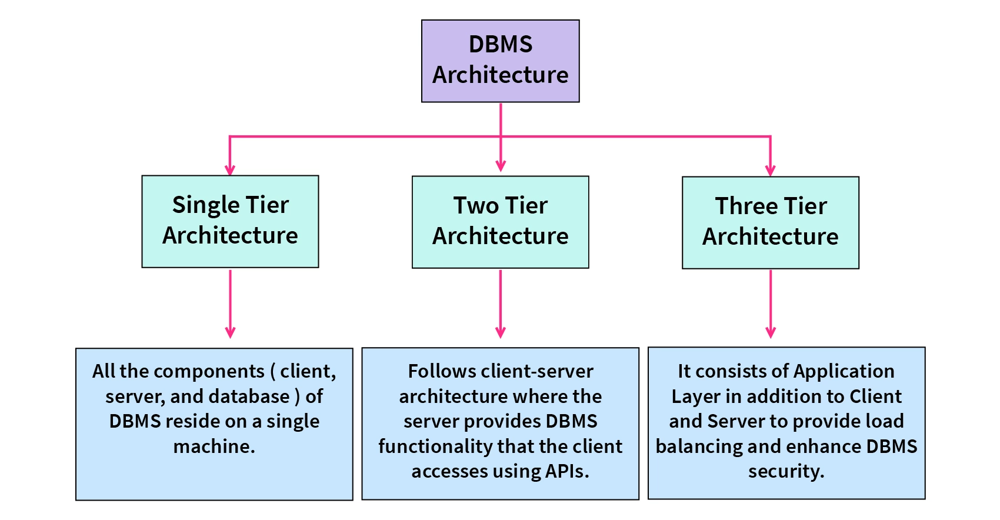
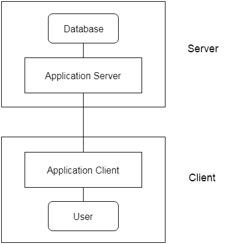

# 🎯Introduction_Of_NodeJS_NPM_and_Mongodb
### JavaScript (1995 - 2009 April)
> - Javascript was created as client side language.
> - Javascript has no power to communicate with the server.
### Javascript Could Not do:
> - Query in database.
> - Handle server side request and response
> - Read/Write file on server.
> - Server side operations. 

## Node JS :
> In 2009 May, Ryan Dahl created a magical thing which now we are calling node.js.

### After Creating Node JS:
> Javascript also used in Frontend and Backend.
### Now Javascript can do:
> - Query in database.
> - Handle server side request and response.
> - Read/Write file on server.
> - Server side operations.
### So what is node.js?
> - Is a server side javascript runtime.✔
> - Not a Programming Language.❌

## What is NodeJS?
> Node JS - 
> - Open source
> - Cross platform
> - JS runtime environment
> - Allow server side scripting
> - Single threaded, Non-blocking
> - Capable of asynchronous I/O
> - Has event-driven architecture

## Runtime environment:
Different data values and functions are available, and these differences help distinguish front-end applications from back-end applications.
- Front-end JavaScript applications are executed in a browser's runtime environment and have access to the window object.
- Back-end JavaScript applications are executed in the Node runtime environment and have access to the file system, database, and networks attached to the server. 

JS code may be executed in one of two runtime environments: 

- A browser's runtime environment
- The Node runtime environment

# What is Database, DBMS, MongoDB, NoSQL vs SQL 
## What is a database?
- Database can be considered as a container filled with data which is electronically stored in a computer system.
- Data in any form can be stored into the database. It is a collection of records. Purpose of storing data in a database is so that it can be easily accessed, modified, protected and analyzed.
- Types of database: Distributed databases, Object-oriented databases, Centralized database, Open-source databases, Cloud databases, NoSQL Databases and many more.

## What is Database management System (DBMS)?
- Database is just a container which stores data whereas Database Management System or DBMS is a software which is used to manage your database.
- You need DBMS to interact with database, to store, modify, retrieve and protect data.
- DBMS is also required to create, modify and delete databases.
- Users can use DBMS to enter commands in specific language to interact with Database.
- Example of a DBMS is MySQL, PostgreSQL, MongoDB, Neo4j, Cassandra etc.

## DBMS Architecture Types

## 3-Tier Architecture
- The 3-Tier architecture contains another layer between the client and server. In this architecture, client can't directly communicate with the server.
- The application on the client-end interacts with an application server which further communicates with the database system.
- End user has no idea about the existence of the database beyond the application server.
- The 3-Tier architecture is used in case of large web application.

# SQL vs NoSQL
## SQL Database
- SQL( Structured Query language) is the standard language for dealing with Relational Databases.
- SQL database or relational database is a collection of highly structured tables
- each row reflects a data entity, and every column defines a specific information field.
- Relational databases are built using the structured query language (SQL) to create, store, update, and retrieve data.
- Therefore, SQL is the underlying programming language for all relational database management systems (RDBMS) such as MySQL, Oracle, and Sybase, among others.

## NoSQL Database
- NoSQL databases are non-tabular databases and store data differently than relational tables
- It avoids joins, and is easy to scale.
- The major purpose of using a NoSQL database is for distributed data stores with humongous data storage needs.

## Types of NoSQL Database
- **Document databases** store data in documents similar to JSON (JavaScript Object Notation) objects. Each document contains pairs of fields and values. The values can typically be a variety of types including things like strings, numbers, booleans, arrays, or objects.
- **Key-value databases** are a simpler type of database where each item contains keys and values.
- **Wide-column stores** store data in tables, rows, and dynamic columns.
- **Graph databases** store data in nodes and edges. Nodes typically store information about people, places, and things, while edges store information about the relationships between the nodes.

## When should NOSQL be used?
When deciding which database to use, decision-makers typically find one or more of the following factors lead them to selecting a NoSQL database:
- Fast-paced Agile development
- Storage of structured and semi-structured data
- Huge volumes of data
- Requirements for scale-out architecture
- Modern application paradigms like microservices and real-time streaming
> To more visit this link: https://www.mongodb.com/nosql-explained/when-to-use-nosql

|SQL|NoSQL|
|---|---|
|SQL databases are primarily called RDBMS or Relational Databases|NoSQL databases are primarily called as Non-relational or distributed database|
|Structured query language (SQL)|No declarative query language|
|SQL databases are table based databases|NoSQL databases can be document based, key-value pairs, graph databases|
|SQL databases have a predefined schema|NoSQL databases use dynamic schema for unstructured data.|
|Oracle, Postgres, MySQL, and MS-SQL | MongoDB, Redis, Neo4j, Cassandra, Hbase|

## MongoDB
- MongoDB is an open-source, cross-platform, distributed document database.
- MongoDB is developed by MongoDB Inc. and categorized as a NoSQL database.
- MongoDB is not a Relational Database Management System (RDBMS).
- It is opposite to SQL based databases where it does not normalize data under schemas and tables where every table has a fixed structure.
- it stores data in the collections as JSON based documents and does not enforce schemas. It does not have tables, rows, and columns as other SQL (RDBMS) databases.

## Advantages of MongoDB
- MongoDB stores data as JSON based document that does not enforce the schema. It allows us to store hierarchical data in a document. This makes it easy to store and retrieve data in an efficient manner.
- It is easy to scale up or down as per the requirement since it is a document based database. MongoDB also allows us to split data across multiple servers.
- MongoDB provides rich features like indexing, aggregation, file store, etc.
- MongoDB performs fast with huge data.
- MongoDB provides drivers to store and fetch data from different applications developed in different technologies such as C#, Java, Python, Node.js, etc.
- MongoDB provides tools to manage MongoDB databases.